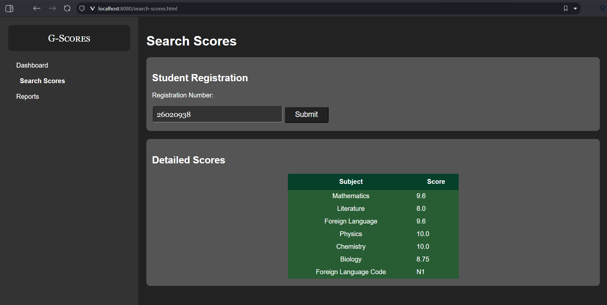

# G-Scores

<!--markdownlint-disable MD033-->

<div style="
  --padding-horizontal: 20px;
  padding-top: 10px;
  padding-bottom: 20px;
  padding-left: var(--padding-horizontal);
  padding-right: var(--padding-horizontal);
  width: calc(100% - 2 * var(--padding-horizontal));
  display: flex;
  flex-direction: row;
  flex-wrap: wrap;
  justify-content: center;
">
  
  
  
</div>



## Overview

This is **G-Scores**, a web application for looking up the result of the High School Graduation Examination.

This application uses **MySQL** as database, **Django** as backend and vanilla JavaScript using **JQuery** with HTML and CSS as frontend. Each part of the application is containerized and can be deployed locally in one go using **Docker Compose**.

The frontend web application's layout is only designed to view on Desktop.

## Requirements

* Docker (Docker CLI and Docker Compose).
* Internet connection.

## Setup

At the root of this repository, add a file `db.docker.env` with the content (see the file [`db.docker.env-example`](./db.docker.env-example)):

```dotenv
MYSQL_HOST=db
MYSQL_USER=<replace this with the actual username>
MYSQL_PASSWORD=<replace this with the actual password>
MYSQL_ROOT_PASSWORD=<replace this with the actual root password>
```

Then run:

```bash
# May takes 1-2 minutes to build
docker-compose up --build --detach
```

After the containers started, go to `http://localhost:8080` to access the frontend. The backend serves at `http://localhost:3000`.

To stop the containers, run:

```bash
docker-compose down -v
```

## To-Dos

* [x] Prepare the CSV file to load to the MySQL database
* [x] Load raw data into the database, see file `db/Dockerfile`
* [x] *Feature*: Check scores by registration number, i.e. `sbd`
* [x] *Feature*: Make report chart of numbers of students with scores in 4 levels by subjects
* [x] *Feature*: List top 10 students of group A (math, physics, chemistry)
* [x] *Feature*: Make a frontend
* [x] *Optional Feature*: Use Docker
* [ ] *Optional Feature*: Responsive design (care for desktop, tablet and mobile phone users)
* [ ] *Optional Feature*: Deploy a Live Demo
  * `localhost` was hard-coded into the code, so it may takes some times to make a live demo
* [ ] *Optional Feature*: Download graphs as images
* [ ] *Optional Feature*: Export tables as CSV files or Excel spreadsheets
